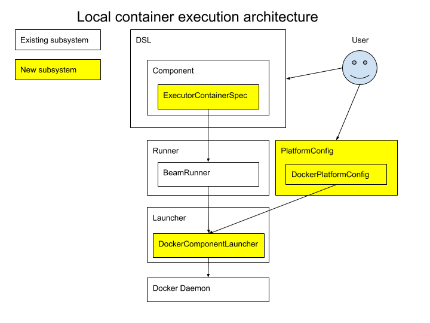
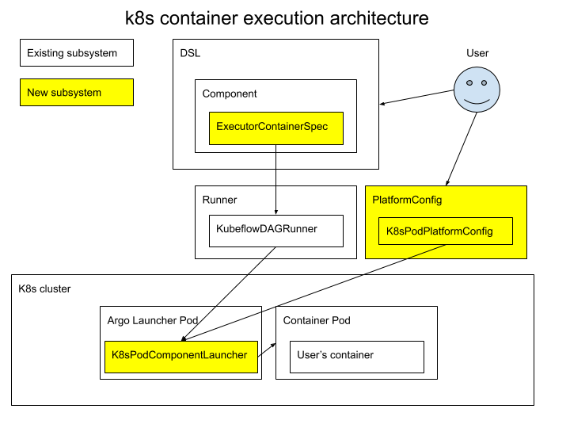
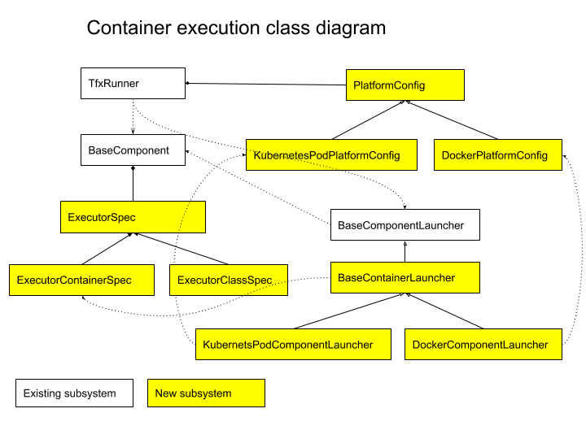

# TFX Container Component Execution Proposal

Status         | Proposed
:------------- | :-------
**Author(s)**  | Ajay Gopinathan (<a href="mailto:ajaygopinathan@google.com">ajaygopinathan@google.com</a>), Hongye Sun (<a href="mailto:hongyes@google.com">hongyes@google.com</a>), Makoto Uchida (<a href="mailto:muchida@google.com">muchida@google.com</a>), Ruoyu Liu (<a href="mailto:ruoyu@google.com">ruoyu@google.com</a>)
**Sponsor(s)** | Konstantinos Katsiapis (katsiapis@google.com), Pavel Dournov (dournov@google.com), Ramesh Chandra (rameshuc@google.com)
**Updated**    | 2019-08-29

## Objective

This RFC proposes an orchestrator agnostic way to reliably execute a user’s
container in the TFX pipeline. The proposal can support:

*   Running an arbitrary container in either a local Docker environment or a remote
    k8s cluster.
*   Passing data into the container
*   Passing output data from the container
*   Capturing logs from the container
*   Handling errors and retries
*   Cancelling the container execution if the pipeline is terminated

## Motivation

Currently, in a TFX pipeline, there is no way to execute a generic container as
one of its steps. Without this feature, users cannot bring their own containers
into the pipeline. This blocks following use cases:

*   User already has a docker image and wants to run the image as one of the
    steps in a TFX pipeline.
*   User wants to use non-Python code (R, for example) as one of the steps in a TFX
    pipeline.
*   User wants to have an isolated Python environment for their component code.

This RFC is a follow-up design for
[Container-based Component RFC](https://github.com/tensorflow/community/pull/146).
This design defines how to execute the container spec as part of a TFX pipeline.
The execution may occurs in local Docker container or in a remote Kubernetes cluster.

### Existing solutions

#### Kubeflow Pipeline (KFP) ContainerOp

Today, KFP’s ContainerOp leverages
[Argo container template API](https://github.com/argoproj/argo/blob/master/pkg/apis/workflow/v1alpha1/workflow_types.go)
to launch user’s container in a k8s pod. Argo, as the orchestrator, controls when
to launch the POD and it uses a sidecar container to report output files back
and wait for user’s container to complete. We are not proposing to use Argo API
because of the following reasons:

*   Argo’s API is orchestrator-specific and cannot be ported to Airflow or local
    runners.
*   Argo’s API doesn’t provide an extensible way to run custom code before and
    after POD API, which is critical to support metadata tracking and caching
    features.
*   Argo doesn’t provide an easy way to recover from user’s transient errors,
    which is critical in production workload.

#### Airflow k8s pod operator

Airflow supports launching a k8s pod by an
[operator](https://github.com/apache/airflow/blob/master/airflow/contrib/operators/kubernetes_pod_operator.py).
This approach is closer to what we are proposing in the document. However, we
cannot directly use the operator because:

*   Airflow operator requires to be run inside an Airflow pipeline which is not
    the case for local and KF runners.
*   Airflow operator exposes a subset of POD’s API, where we want to expose the
    full pod spec to the user.
*   Airflow operator doesn’t provide a reliable way to retry user’s container
    and recover from transient errors.
*   Airflow does not support initializing an operator inside another operator.
    Going back to using multiple Airflow operators for a component is a regression
    now that we have `BaseComponentLauncher` ready.

## Proposed Design

### TLDR

We propose to solve the above problems by the following design.

*   Define container as an executor spec.
*   Launch container by component launcher in either local docker or k8s pod.
*   Use platform config to specify platform specific settings like k8s pod
    config.

The proposed solution has the following parts:

*   Extensible `ExecutorSpec` concept which can support a container as an
    executor.
*   Extensible `BaseComponentLauncher` concept to support pluggable component
    launchers in a TFX runner.
    *   `DockerComponentLauncher` which launches `ExecutorContainerSpec` in
        a Docker environment.
    *   `KubernetesPodComponentLauncher` which launches `ExecutorContainerSpec`
        in a k8s environment.
*   Extensible `PlatformConfig` framework.
    *   `KubernetesPodPlatformConfig` to support k8s pod spec as a config.
    *   `DockerPlatformConfig` to support docker run configs.

### Architecture

Architecture that allows local container execution.



Architecture that allows Kubernetes container execution.



Class diagram that allows container execution



### Python DSL experience

In order to use container base component in TFX DSL, user needs follow these
steps. Step 1 and Step 2 follow the DSL extension proposed by the other RFC
(https://github.com/tensorflow/community/pull/146).

#### Step 1: Define the container based component by `ExecutorContainerSpec`

```python
class MyContainerBasedExampleGen(BaseComponent):

  SPEC_CLASS = types.make_spec_class(
    inputs={
      "raw_input": ChannelParameter(type=standard_artifacts.ExternalArtifact),
    }
    outputs={
      "examples": ChannelParameter(type=standard_artifacts.Examples),
    }
    parameters={
      "num_csv_columns": ExecutionParameter(type=int),
    }
  )

  EXECUTOR_SPEC = ExecutorContainerSpec(
    container_image='gcr.io/my_project/my_example_gen:stable',
    command=['python'],
    args=['my_example_gen.py',
          '--input_csv_file', '{{ inputs.raw_input.uri }}',
          '--output_examples', '{{ outputs.examples.uri }}',
          '--num_csv_columns', '{{ exec_props.num_csv_columns }}' ],
  )
```

#### Step 2: Create pipeline from container based component

```python
def create_pipeline():
  my_csv_file = Channel('CSVFile', uri="/path/to/csv_file")

  my_example_gen = MyContainerBasedExampleGen(
        raw_input=my_csv_file, num_csv_columns=20)

  return pipeline.Pipeline(
    pipeline_name = 'my_container_based_pipeline',
    pipeline_root = 'gs://path/to/root',
    components = [my_example_gen],
    ...
  )
```

#### Step 3(a): Set docker config via runner’s config

```python
_ = BeamRunner(platform_configs={
  'MyContainerBasedExampleGen': [DockerPlatformConfig(volumes={...})]
}).run(create_pipeline())
```

#### Step 3(b): Set k8s platform config via runner’s config

```python
_ = KubeflowDagRunner(platform_configs={
  'default': [KubernetesPodPlatformConfig(Pod().use_gcp_secret().spec()]
  'MyContainerBasedExampleGen': [
      KubernetesPodPlatformConfig(Pod(cpu=2, memory='1GB').spec())]}
).run(create_pipeline())
```

### Component launcher

A component launcher launches a component by invoking a driver, an executor and
a publisher. It understands how to launch a component executor from an
`ExecutorSpec`. The `BaseComponentLauncher` is an abstract base class with two
abstract methods:

*   `can_launch`: public method to check whether the launcher can launch an
    instance of `ExecutorSpec` with a specified `PlatformConfig` instance. The
    method will be used by `TfxRunner` to choose launcher for a component.
*   `_run_executor`: a protected method to launch an `ExecutorSpec` instance.
    The method is invoked by `BaseComponentLauncher.launch` method.

Subclasses of the base component launcher can support launching executors in
different target platforms. For example:

*   `InProcessComponentLauncher` can launch an executor class in the same Python
    process.
*   `DockerComponentLauncher` can launch a container executor in a Docker
    environment.
*   `KubernetesPodComponentLauncher` can launch a container executor in a k8s
    environment.
*   A Dataflow launcher can launch a beam executor in Dataflow service.

Pseudo implementation:

```python
class BaseComponentLauncher(with_metaclass(abc.ABCMeta, object)):
  @abc.abstractmethod
  @classmethod
  def can_launch(cls, executor_spec: ExecutorSpec,
                 platform_spec: Optional[PlatformConfig]) -> bool:
    return False

  @abc.abstractmethod
  def _run_executor(execution_id: int,
                   input_dict: Dict[Text, List[types.Artifact]],
                   output_dict: Dict[Text, List[types.Artifact]],
                   exec_properties: Dict[Text, Any]) -> Any:
    pass

class InProcessComponentLauncher(BaseComponentLauncher):
  # InProcessComponentLauncher implements default launcher for python executor.
  # It doesn't support platform_spec.
  @classmethod
  def can_launch(cls, executor_spec: ExecutorSpec,
                 platform_spec: Optional[PlatformConfig]) -> bool:
    if platform_spec:
      return False
    return isinstance(executor_spec, ExecutorClassSpec)

  def _run_executor(execution_id: int,
                   input_dict: Dict[Text, List[types.Artifact]],
                   output_dict: Dict[Text, List[types.Artifact]],
                   exec_properties: Dict[Text, Any]) -> Any:
    # Python in process launcher implementation.
    # Subclass should override this method to implement platform launcher
    …

class DockerComponentLauncher(BaseComponentLauncher):

  @classmethod
  def can_launch(cls, executor_spec: ExecutorSpec,
                 platform_spec: Optional[PlatformConfig]) -> bool:
    if not isinstance(executor_spec, ExecutorContainerSpec):
      return false

    if not platform_spec:
      return true

    return isinstance(platform_spec, DockerPlatformConfig):

  def _run_executor(execution_id: int,
                   input_dict: Dict[Text, List[types.Artifact]],
                   output_dict: Dict[Text, List[types.Artifact]],
                   exec_properties: Dict[Text, Any]) -> None:
    # Docker launcher implementation
    ...

class KubernetesPodComponentLauncher(BaseComponentLauncher):
  @classmethod
  def can_launch(cls, executor_spec: ExecutorSpec,
                 platform_spec: Optional[PlatformConfig]) -> bool:
    if not isinstance(executor_spec, ExecutorContainerSpec):
      return false

    if not platform_spec:
      return true

    return isinstance(platform_spec, DockerPlatformConfig):

  def _run_executor(execution_id: int,
                   input_dict: Dict[Text, List[types.Artifact]],
                   output_dict: Dict[Text, List[types.Artifact]],
                   exec_properties: Dict[Text, Any]) -> None:
    # k8s pod launcher implementation
    …
```

### Platform config

Platform config carries platform specific configs. Usually, one platform config
type maps to one component launcher type. For example,
`DockerPlatformConfig` can only be used by `DockerComponentLauncher` and
`KubernetesPodPlatformConfig` can only be used by
`KubernetesPodComponentLauncher`.

Each platform config can be merged with another config with the same type. This
capacity is needed to support a layered configuration system in runner’s config:

*   User can define a default platform config list which will be applied to all
    components in the pipeline.
*   User can define component specific config by using component’s name as a
    selector.
*   Component specific config should override the default config.

Pseudo implementation:

```python
class PlatformConfig(with_metaclass(abc.ABCMeta, object)):
  def merge(self, platform_config: PlatformConfig) -> PlatformConfig:
    """Merge the current config with a new config.
    Usually, it only happens when component config is merged with default config.
    """
    # Simple recursive dictionary merge logic

class DockerPlatformConfig(PlatformConfig):
  def __init__(self, **kwargs):
    # The kwargs is the same as the list defined in
    # https://docker-py.readthedocs.io/en/stable/containers.html#docker.models.containers.ContainerCollection.run
    self.run_kwargs = kwargs

class KubernetesPodPlatformConfig(PlatformConfig):
  def __init__(self, pod_spec: V1PodSpec):
    self.pod_spec = pod_spec
```

#### Pod spec layers

A final pod spec is merged by 3 layers of pod specs. They are:

*   Base pod spec layer
*   Default config spec layer
*   Component specific config spec layer

The merge logic follows
[strategic merge patch](https://kubernetes.io/docs/tasks/run-application/update-api-object-kubectl-patch/#use-a-strategic-merge-patch-to-update-a-deployment)
to merge layers in order: base -> default -> component config.

Strategic merge patch is different from JSON patch by merging lists and maps
instead of replacing them entirely. In this way, the patch layer doesn’t have to
specify the full content of a list or map.

The base pod spec layer is created from user’s container spec. The pod spec
includes a main container spec with image path and entrypoint of the container.

Default and component platform configs are configured by runner’s constructor.

For example:

```yaml
# base pod spec
apiVersion: v1
kind: Pod
spec:
  containers:
  - name: main
    image: tensorflow/tensorflow:v1.13
    command: ["python", "-c", "ml/app.py"]

# pipeline pod spec
spec:
  serviceAccountName: PipelineRunner
  containers:
  - name: main
    resources:
      limits:
        memory: "128Mi"
        cpu: "500m"

# component config pod spec
spec:
  containers:
  - name: main
    env:
    - name: MYSQL_ROOT_PASSWORD
      value: "password"

# final pod spec
apiVersion: v1
kind: Pod
spec:
  serviceAccountName: PipelineRunner
  containers:
  - name: main
    image: tensorflow/tensorflow:v1.13
    command: ["python", "-c", "ml/app.py"]
    resources:
      limits:
        memory: "128Mi"
        cpu: "500m"
    env:
    - name: MYSQL_ROOT_PASSWORD
      value: "password"
```

### TFX runner

A `TFXRunner` compiles a logical pipeline into the underlying orchestrator’s DSL. In
this proposal, the base runner should accept launchers and `platform_configs`
and provide a default strategy to choose launcher for each component.

The default choosing logic is:

*   If `platform_configs` is set, use it along with executor spec to find the
    first launcher which can support them.
*   Otherwise, find the first launcher which can support the executor spec
    without `platform_configs`.
*   `platform_configs` has higher priority than `default_platform_configs`.

Pseudo implementation:

```python
class TfxRunner(with_metaclass(abc.ABCMeta, object)):
  def __init__(self, launchers: List[BaseComponentLauncher],
               platform_configs: Dict[Text, List[PlatformConfig]]):
    self.launchers = launchers
    self.default_platform_configs = platform_configs.get('default')
    self.platform_configs = platform_configs

  def _get_component_launch_info(
      self, component: BaseComponent) -> ComponentLaunchInfo:
    component_platform_configs = self.platform_configs.get(component.name)
    # Use PlatformConfig.merge to merge configs with the same type.
    component_platform_configs = self._merge_platform_configs(
      component_platform_configs, self.default_platform_configs)
    # Select launcher by platform config.
    for platform_config in component_platform_configs:
      for launcher in self.launchers:
        if launcher.can_launch(component.executor_spec, platform_config):
          return ComponentLaunchInfo(component, launcher, platform_config)
    for launcher in self.launchers:
      if launcher.can_launch(component.executor_spec):
        return ComponentLaunchInfo(component, launcher)

  def run(self, pipeline) -> Optional[Any]:
    component_launcher_infos = {c.name: self._get_component_launch_info(c)
                                for c in pipeline.components)}
    return self._run(self, pipeline, component_launcher_infos)

  @abc.abstractmethod
  def _run(self, pipeline, component_launcher_infos) -> Optional[Any]:
    pass
```

### Output interface

User container can receive a
[tmp directory path from default artifact store](https://github.com/tensorflow/community/blob/2c0b009ef955975b15a3cc18b1378e0ed38f394e/rfcs/20190904-tfx-generic-container-based-component.md#artifact-properties-after-execution-is-complete)
to write output data. The directory parameter will be called
`exec_properties.tmp_path`, which can be passed in as a command line argument.
The executor will look for `output.json` file under `exec_properties.tmp_path`
to get the outputs from the component. The output file follows the following
schema:

```yaml
"$id": https://pipeline.mlx.org/output.schema.json"
"$schema": http://json-schema.org/draft-07/schema#"
type: object
title: Output
properties:
  error_status: { "$ref": "#/definitions/OutputErrorStatus" }
  outputs:
    type: object
  exec_properties:
    type: object
definitions:
  OutputErrorStatus:
    type: object
    properties:
      code:
        type: string
        enum: [PERMANENT_ERROR, RETRYABLE_ERROR]
      message:
        type: string
```

The output.json file is optional, but if the user’s container writes to the file. It
overrides the default handling of the k8s pod launcher. The output fields are:

*   error_status: tells the executor whether it should retry or fail
*   outputs and exec_properties: used to override the execution and
    output artifact metadata in MLMD.

The output interfaces rely on `BaseComponentLauncher` to update states back to
MLMD from executor.

### Auth context resolution

The k8s pod launcher internally uses the k8s Python client. The auth context resolution
logic is as follows:

1.  If the current env is in a cluster, use `load_incluster_config` to load k8s
    context.
1.  If not, use default k8s active context to connect to remote cluster.

### Pod launcher resiliency

In this design section, we focused more on the launcher resiliency under
`KubeflowDAGRunner`. In `AirflowDAGRunner`, the launcher code is running in the
same process of Airflow orchestrator which we rely on Airflow to ensure its
resiliency. `BeamDAGRunner`, however, is considered mainly for local testing
purpose and we won't add support for it to be resilient.

In `KubeflowDAGRunner`, a pipeline step will create two pods in order to execute
user’s container:

*   A launcher pod which contains the driver, k8s pod launcher, and publisher code.
*   A user pod with user’s container.

A pod in k8s is not resilient by itself. We will use Argo’s retry feature to make
the launcher pod partially resilient. The details are as follows:

*   Each Argo launcher step will be configured with a default retry count.
*   Argo will retry the step in case of failure, no matter what type of error.
*   The launcher container will create a tmp workdir in `pipeline_root`.
*   It will keep intermediate results (for example, the ID of the created pod) in the tmp workdir.
*   The k8s pod launcher will be implemented in a way that it will resume the
    operation based on the intermediate results in the tmp workdir.
*   The launcher will also record a permanent failure data in the tmp workdir so
    it won’t resume the operation in case of non-retriable failures.

### Default retry strategy

K8s pod launcher supports exponential backoff retry. This strategy applies to
all runners which can support k8s pod launcher. Docker launchers are not in the
scope of the design as it is mainly for local development use case.

The retry only happens if the error is retriable. An error is retriable only
when:

*   It’s a transient error code from k8s pod API.
*   The output.json file from artifact store indicates it’s a retriable error.
*   The pod get deleted (For example: GKE preemptible pod feature).

### Log streaming

The container launcher streams the log from user’s docker container or k8s pod through the
API. It will start a thread which constantly pulls new logs and outputs them to
local stdout.

### Cancellation

How the container launcher handles cancellation request varies by orchestrators:

*   Airflow natively supports cancellation propagation to operator. We will need
    to pass the cancellation request from operator into executor.
*   Argo doesn’t natively support cancellation propagation. Currently KFP relies
    on Argo’s pod annotation to workaround the limitation and has been proven
    to work. We will use the same process to propagate cancellation requests to
    user’s container.

In order to allow the user to specify the cancellation command line entrypoint, the k8s
pod launcher will support an optional parameter called `cancellation_command`
from `ExecutorContainerSpec`.

## Open discussions

*   In the Argo runner, each step requires 2 pods with total 3 containers (launcher
    main container + launcher argo wait container + user main container) to run.
    Although each launcher container requires minimal k8s resources,
    resource usage is still a concern.
